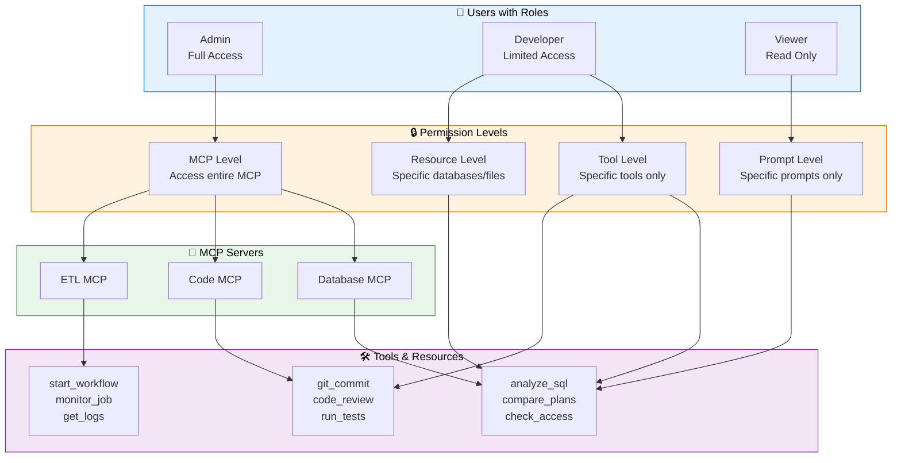
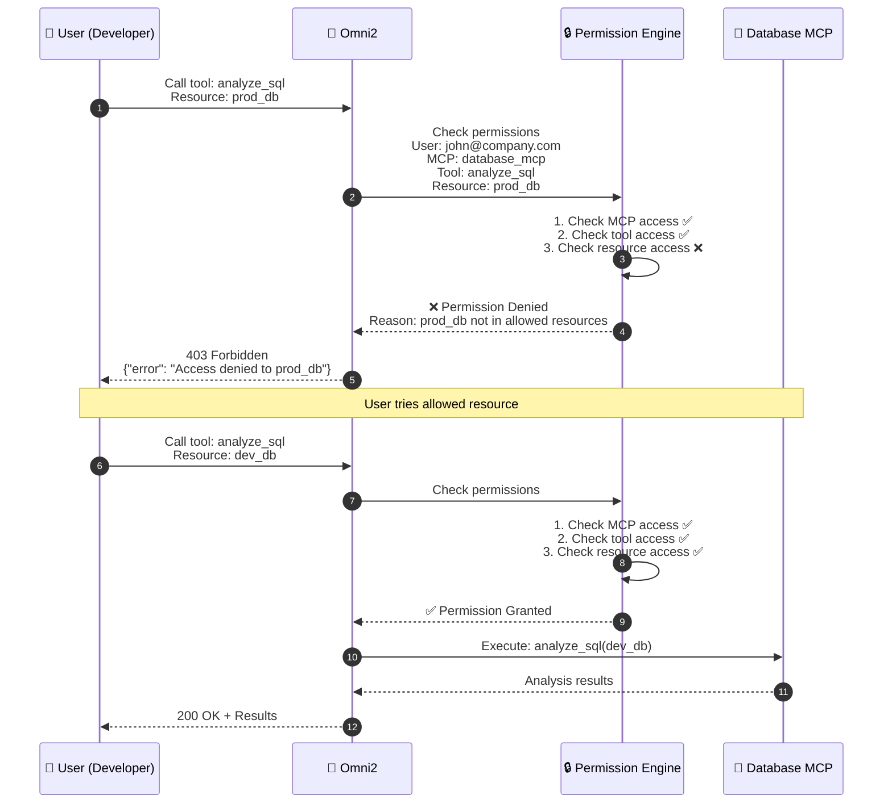
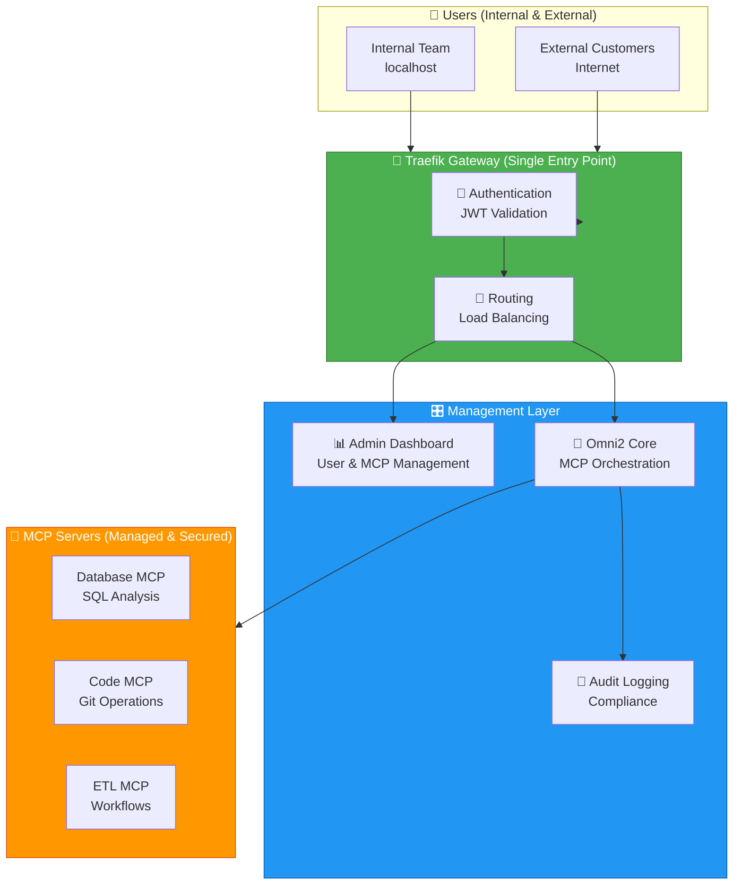
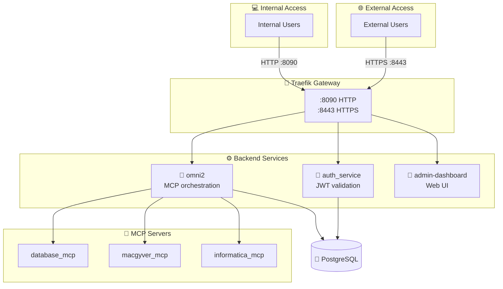
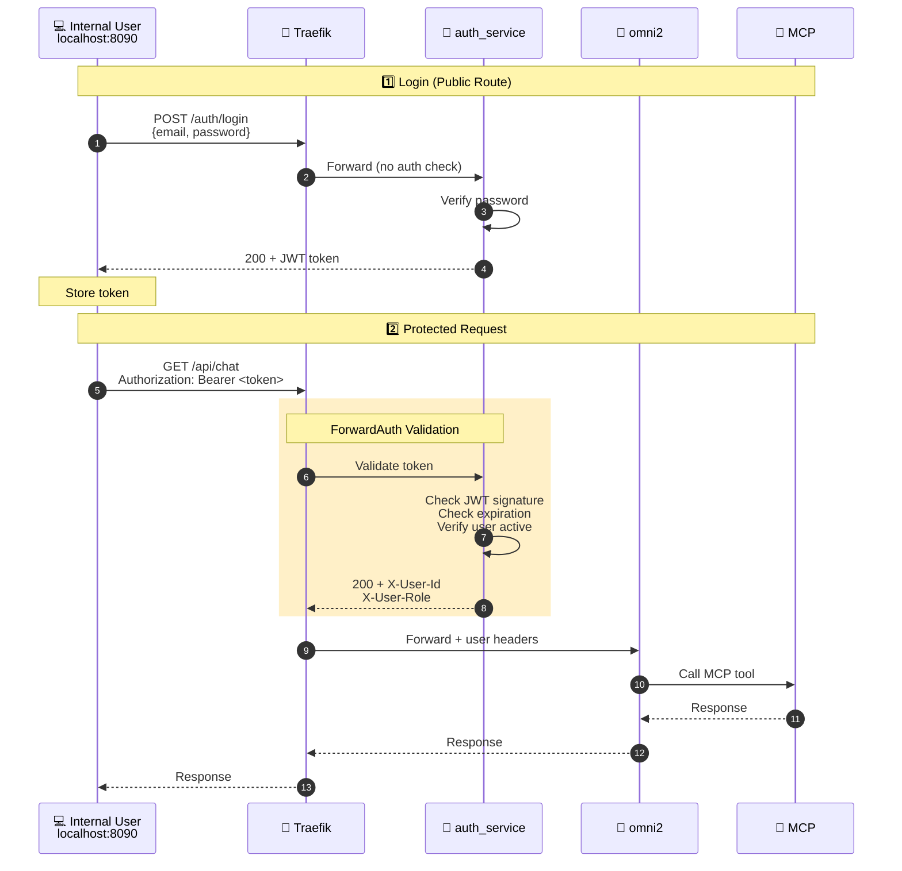
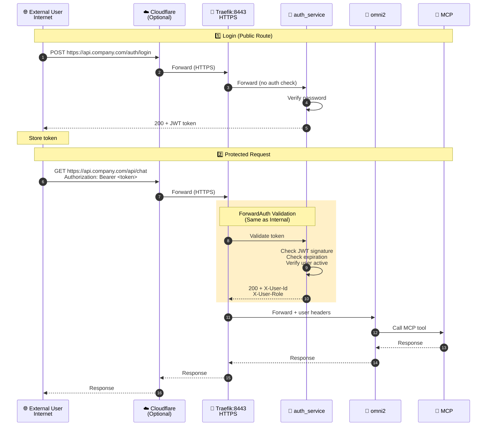

# Omni2 - AI-Powered MCP Orchestration Platform

**Enterprise-grade platform for orchestrating Model Context Protocol (MCP) servers with built-in security, authentication, and monitoring**

[](https://opensource.org/licenses/MIT)
[](https://www.python.org/downloads/)
[](https://www.docker.com/)
[](https://aviciot.github.io/omni2-bridge/)

**[📖 Full Documentation](https://aviciot.github.io/omni2-bridge/)**

---

## 🎯 What is Omni2?

Omni2 is a **secure MCP management and orchestration platform** that enables organizations to:

- **🔐 Securely Expose MCPs** - Control who can access your MCP servers with JWT authentication and RBAC
- **📊 Monitor & Manage** - Real-time health checks, audit logging, and performance metrics
- **🚀 Scale with Confidence** - Load balancing, automatic failover, and horizontal scaling
- **🎨 Centralized Control** - Web dashboard for managing users, MCPs, and configurations

---

## 🔐 Granular Access Control

**Omni2 provides fine-grained permissions at multiple levels:**



### Permission Examples

#### Example 1: Database MCP Access Control

| User Role | MCP Access | Tool Access | Resource Access | What They Can Do |
|-----------|------------|-------------|-----------------|------------------|
| **Admin** | ✅ Full | ✅ All tools | ✅ All databases | Execute any SQL analysis on any database |
| **Developer** | ✅ Yes | ✅ `analyze_sql`<br/>❌ `check_access` | ✅ `dev_db`<br/>❌ `prod_db` | Analyze queries only on dev database |
| **Analyst** | ✅ Yes | ✅ `analyze_sql`<br/>❌ `compare_plans` | ✅ `analytics_db`<br/>❌ `prod_db` | Read-only analysis on analytics database |
| **Viewer** | ❌ No | ❌ No tools | ❌ No resources | Can only view pre-approved prompts/reports |

**Configuration Example:**
```json
{
  "user": "john@company.com",
  "role": "developer",
  "permissions": {
    "database_mcp": {
      "enabled": true,
      "tools": ["analyze_sql", "compare_plans"],
      "resources": ["dev_db", "staging_db"],
      "denied_resources": ["prod_db"]
    }
  }
}
```

#### Example 2: Code MCP Access Control

| User Role | MCP Access | Tool Access | Resource Access | What They Can Do |
|-----------|------------|-------------|-----------------|------------------|
| **Admin** | ✅ Full | ✅ All tools | ✅ All repos | Commit, review, deploy to any repository |
| **Senior Dev** | ✅ Yes | ✅ `git_commit`<br/>✅ `code_review`<br/>❌ `deploy` | ✅ `backend-api`<br/>✅ `frontend-app` | Commit and review code, no production deploy |
| **Junior Dev** | ✅ Yes | ✅ `code_review`<br/>❌ `git_commit` | ✅ `feature-branches` | Review code only, cannot commit |
| **QA** | ✅ Yes | ✅ `run_tests`<br/>❌ `git_commit` | ✅ `test-env` | Run tests only, no code changes |

**Configuration Example:**
```json
{
  "user": "sarah@company.com",
  "role": "senior_developer",
  "permissions": {
    "code_mcp": {
      "enabled": true,
      "tools": ["git_commit", "code_review", "run_tests"],
      "resources": ["backend-api", "frontend-app"],
      "denied_tools": ["deploy"],
      "denied_resources": ["prod-*"]
    }
  }
}
```

#### Example 3: ETL MCP Access Control

| User Role | MCP Access | Tool Access | Resource Access | What They Can Do |
|-----------|------------|-------------|-----------------|------------------|
| **Admin** | ✅ Full | ✅ All tools | ✅ All workflows | Start, stop, monitor any ETL workflow |
| **ETL Engineer** | ✅ Yes | ✅ `start_workflow`<br/>✅ `monitor_job`<br/>❌ `delete_workflow` | ✅ `dev_workflows`<br/>❌ `prod_workflows` | Manage dev workflows only |
| **Data Analyst** | ✅ Yes | ✅ `monitor_job`<br/>✅ `get_logs`<br/>❌ `start_workflow` | ✅ `analytics_workflows` | Monitor and view logs, cannot start jobs |
| **Auditor** | ✅ Yes | ✅ `get_logs`<br/>❌ All others | ✅ All workflows | View logs only for compliance |

**Configuration Example:**
```json
{
  "user": "mike@company.com",
  "role": "etl_engineer",
  "permissions": {
    "informatica_mcp": {
      "enabled": true,
      "tools": ["start_workflow", "monitor_job", "get_logs"],
      "resources": ["dev_*", "staging_*"],
      "denied_resources": ["prod_*"],
      "denied_tools": ["delete_workflow", "modify_connection"]
    }
  }
}
```

#### Example 4: Prompt-Level Access Control

**Use Case:** Allow business users to run pre-approved prompts without tool access.

| User Role | MCP Access | Prompt Access | What They Can Do |
|-----------|------------|---------------|------------------|
| **Business User** | ❌ No direct access | ✅ "Daily Sales Report"<br/>✅ "Customer Analytics" | Run only approved prompts via dashboard |
| **Manager** | ❌ No direct access | ✅ "Team Performance"<br/>✅ "Budget Analysis" | Access management reports only |

**Configuration Example:**
```json
{
  "user": "lisa@company.com",
  "role": "business_user",
  "permissions": {
    "database_mcp": {
      "enabled": false,
      "tools": [],
      "prompts": [
        {
          "id": "daily_sales_report",
          "name": "Daily Sales Report",
          "tool": "analyze_sql",
          "params": {"db": "analytics_db", "query": "<pre-approved>"}
        },
        {
          "id": "customer_analytics",
          "name": "Customer Analytics",
          "tool": "analyze_sql",
          "params": {"db": "analytics_db", "query": "<pre-approved>"}
        }
      ]
    }
  }
}
```

### How It Works



**Benefits:**
- ✅ **Least Privilege** - Users only access what they need
- ✅ **Compliance** - Audit trail of who accessed what
- ✅ **Flexibility** - Permissions at MCP, tool, resource, and prompt levels
- ✅ **Safety** - Prevent accidental production changes
- ✅ **Scalability** - Manage permissions centrally for hundreds of users

---

## 🏗️ System Architecture Overview



**Key Capabilities:**

| Feature | Benefit |
|---------|----------|
| **Centralized Auth** | Single sign-on for all MCPs - no per-MCP authentication needed |
| **Access Control** | Role-based permissions (admin, developer, viewer) |
| **Audit Trail** | Track every MCP call with user, timestamp, and parameters |
| **Health Monitoring** | Real-time status of all MCP servers with automatic alerts |
| **Secure by Default** | MCPs never exposed directly - only via authenticated gateway |
| **Production Ready** | HTTPS, rate limiting, DDoS protection via Cloudflare |

---

## 🌟 Features

- **🔐 Enterprise Security** - JWT authentication, RBAC, ForwardAuth middleware
- **🚪 Traefik Gateway** - Single entry point, load balancing, HTTPS termination
- **🤖 MCP Orchestration** - Route AI requests to specialized MCP servers
- **📊 Audit Logging** - Track all user actions and API calls
- **⚡ High Performance** - Async Python, connection pooling, caching
- **🔄 Circuit Breaker** - Automatic failover and retry logic
- **📈 Monitoring** - Health checks, metrics, and observability
- **🎨 Admin Dashboard** - Web UI for managing users, MCPs, and settings

---

## 🏗️ Architecture



**How Traefik Handles Internal vs External Users:**

Traefik treats both **internal** and **external** users identically in terms of authentication:

| Aspect | Internal Users | External Users | Same Auth? |
|--------|----------------|----------------|------------|
| **Access** | `http://localhost:8090` | `https://your-domain.com` (via Cloudflare) | ✅ Yes |
| **Authentication** | JWT token in `Authorization` header | JWT token in `Authorization` header | ✅ Yes |
| **ForwardAuth** | Validates every protected request | Validates every protected request | ✅ Yes |
| **User Headers** | Receives `X-User-Id`, `X-User-Role` | Receives `X-User-Id`, `X-User-Role` | ✅ Yes |
| **Security** | Same JWT validation via auth_service | Same JWT validation via auth_service | ✅ Yes |

**Key Point:** The only difference is the entry point (HTTP vs HTTPS). Once inside Traefik, the authentication flow is identical.

**[View Detailed Architecture →](./docs/architecture/TRAEFIK_ARCHITECTURE.md)**

---

## 🚀 Quick Start

### Prerequisites

- Docker Desktop
- 8GB RAM minimum
- Ports: 8090, 8091, 5433

### Installation

```bash
# 1. Clone repository
git clone https://github.com/your-org/omni2.git
cd omni2

# 2. Configure environment
cp .env.example .env
# Edit .env with your settings

# 3. Start services
./start.sh

# 4. Verify installation
curl http://localhost:8090/health
```

**[Full Setup Guide →](./docs/deployment/QUICK_START.md)**

---

## 📚 Documentation

### Getting Started
- [Quick Start Guide](./docs/deployment/QUICK_START.md) - Get running in 5 minutes
- [Production Setup](./docs/deployment/PRODUCTION_SETUP.md) - Deploy to production
- [Environment Variables](./docs/deployment/ENVIRONMENT_VARIABLES.md) - Configuration reference

### Architecture
- [System Overview](./docs/architecture/SYSTEM_OVERVIEW.md) - High-level architecture
- [Traefik Gateway](./docs/architecture/TRAEFIK_ARCHITECTURE.md) - Reverse proxy & auth
- [Database Schema](./docs/architecture/DATABASE_SCHEMA.md) - PostgreSQL design
- [Authentication Flow](./docs/architecture/AUTHENTICATION_FLOW.md) - JWT & ForwardAuth

### Security
- [Security Overview](./docs/security/SECURITY_OVERVIEW.md) - Multi-layer security
- [Authentication](./docs/security/AUTHENTICATION.md) - JWT tokens & API keys
- [Authorization](./docs/security/AUTHORIZATION.md) - RBAC & permissions
- [Network Security](./docs/security/NETWORK_SECURITY.md) - IP whitelisting & HTTPS

### MCP Integration
- [Adding New MCPs](./docs/mcp-integration/ADDING_NEW_MCP.md) - Step-by-step guide
- [MCP Configuration](./docs/mcp-integration/MCP_CONFIGURATION.md) - Settings & auth
- [Best Practices](./docs/mcp-integration/BEST_PRACTICES.md) - Design patterns
- [Available MCPs](./docs/mcp-integration/AVAILABLE_MCPS.md) - Integrated MCPs

### Development
- [Development Setup](./docs/development/SETUP.md) - Local environment
- [Testing Guide](./docs/development/TESTING.md) - Test coverage
- [API Reference](./docs/development/API_REFERENCE.md) - REST API docs
- [Contributing](./docs/development/CONTRIBUTING.md) - How to contribute

---

## 🔐 Security

Omni2 implements **4 layers of security**:

1. **Edge Security (Traefik)** - HTTPS, rate limiting, IP whitelisting
2. **Authentication (auth_service)** - JWT tokens, API keys, password hashing
3. **Authorization (Backend)** - RBAC, permission checks, resource validation
4. **Data Security (MCPs)** - SQL injection prevention, query validation

### Authentication Flow

#### Internal User Flow (Development/Office)



#### External User Flow (Production/Internet)



**Key Differences:**

| Step | Internal User | External User |
|------|---------------|---------------|
| **Entry Point** | `http://localhost:8090` | `https://api.company.com` (via Cloudflare) |
| **Protocol** | HTTP (local network) | HTTPS (encrypted) |
| **Auth Flow** | ✅ Same JWT validation | ✅ Same JWT validation |
| **User Headers** | ✅ Same headers | ✅ Same headers |
| **Backend Logic** | ✅ Identical | ✅ Identical |

**Important:** Traefik doesn't distinguish between internal and external users. Both go through the same ForwardAuth middleware and receive the same treatment.

**Security Benefits:**
- ✅ **Single Auth Point** - Only auth_service validates JWT
- ✅ **Unified Security** - Internal and external users have identical auth
- ✅ **No Token in Backend** - omni2 & MCPs only see user headers
- ✅ **Zero Trust** - Every request validated, no exceptions

**[Security Documentation →](./docs/security/SECURITY_OVERVIEW.md)**

---

## 🧪 Testing

### Automated Tests

```bash
# Run all tests
pytest

# Run specific test suite
pytest tests/test_auth.py

# Run with coverage
pytest --cov=app tests/
```

### Test Coverage

- **Authentication**: 95% coverage
- **Authorization**: 92% coverage
- **MCP Integration**: 88% coverage
- **API Endpoints**: 90% coverage

**Test Results:** 8/9 Traefik tests passed ✅

**[Testing Guide →](./docs/development/TESTING.md)**

---

## 📊 Performance

### Current Metrics

- **Request Latency**: <100ms (p95)
- **Throughput**: ~1000 req/sec
- **Concurrent Users**: ~100 (single instance)
- **MCP Response Time**: 2-5s (varies by MCP)

### Scaling

- **Phase 1** (Current): Single instances → ~100 users
- **Phase 2** (Future): Horizontal scaling → ~500 users
- **Phase 3** (Future): High availability → ~2000+ users

---

## 🛠️ Technology Stack

### Backend
- **Python 3.12** - Modern async Python
- **FastAPI** - High-performance web framework
- **SQLAlchemy** - ORM with async support
- **PostgreSQL** - Primary database
- **Redis** - Caching (future)

### Gateway
- **Traefik v3.6** - Reverse proxy & load balancer
- **Docker** - Containerization
- **Docker Compose** - Orchestration

### Frontend (Dashboard)
- **Next.js 14** - React framework
- **TypeScript** - Type safety
- **Tailwind CSS** - Styling
- **shadcn/ui** - Component library

---

## 📦 Project Structure

```
omni2/
├── app/                    # Main application
│   ├── routers/           # API endpoints
│   ├── services/          # Business logic
│   ├── models.py          # Database models
│   └── main.py            # FastAPI app
├── docs/                   # Documentation
│   ├── architecture/      # System design
│   ├── security/          # Security guides
│   ├── deployment/        # Setup guides
│   ├── mcp-integration/   # MCP guides
│   └── development/       # Dev docs
├── traefik-external/      # Traefik gateway
├── tests/                 # Test suite
├── migrations/            # Database migrations
├── docker-compose.yml     # Service orchestration
└── README.md             # This file
```

---

## 🤝 Contributing

We welcome contributions! Please see our [Contributing Guide](./docs/development/CONTRIBUTING.md).

### Development Workflow

1. Fork the repository
2. Create a feature branch
3. Make your changes
4. Write tests
5. Submit a pull request

### Code Standards

- Python: PEP 8, type hints, docstrings
- Tests: pytest, 80%+ coverage
- Commits: Conventional commits
- Documentation: Keep docs updated

---

## 📝 License

This project is licensed under the MIT License - see the [LICENSE](LICENSE) file for details.

---

## 🆘 Support

- **Documentation**: [Full Docs](./docs/README.md)
- **Issues**: [GitHub Issues](https://github.com/aviciot/omni2-bridge/issues)
- **Discussions**: [GitHub Discussions](https://github.com/aviciot/omni2-bridge/discussions)
- **Email**: avicoiot@gmail.com

---

## 👤 Author

**Avi Cohen**  
📧 Email: avicoiot@gmail.com  
🐙 GitHub: [@aviciot](https://github.com/aviciot)  
💼 LinkedIn: [Avi Cohen](https://www.linkedin.com/in/avi-cohen)

*Built with passion to solve real enterprise challenges in AI infrastructure*

---

## 🙏 Acknowledgments

- [FastMCP](https://github.com/jlowin/fastmcp) - MCP server framework
- [Traefik](https://traefik.io/) - Reverse proxy
- [FastAPI](https://fastapi.tiangolo.com/) - Web framework
- [Model Context Protocol](https://modelcontextprotocol.io/) - MCP specification

---

## 📈 Roadmap

### Q1 2026
- [x] Core platform with authentication
- [x] Traefik gateway integration
- [x] Admin dashboard MVP
- [ ] WebSocket support for streaming
- [ ] Redis caching layer

### Q2 2026
- [ ] Horizontal scaling support
- [ ] Prometheus metrics export
- [ ] Grafana dashboards
- [ ] Advanced RBAC features
- [ ] MCP marketplace

### Q3 2026
- [ ] Multi-tenancy support
- [ ] Advanced monitoring
- [ ] Auto-scaling
- [ ] High availability setup

---

**Made with ❤️ by [Avi Cohen](https://github.com/aviciot)**
