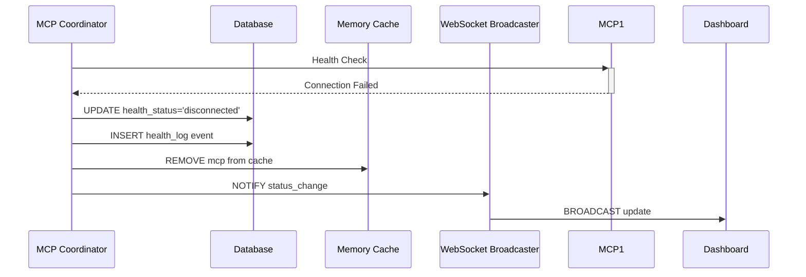
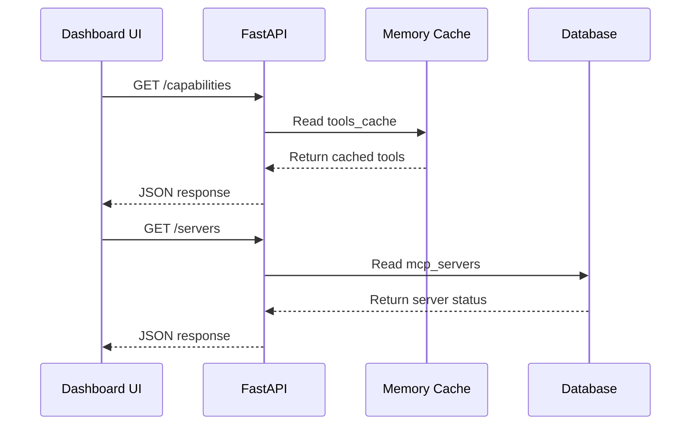

# **Robust MCP Management Architecture**

## **System Architecture Overview**

```mermaid
graph TB
    subgraph "Dashboard Frontend (Browser)"
        UI[Dashboard UI]
        WS_CLIENT[WebSocket Client]
        POLL[Polling Fallback]
    end
    
    subgraph "Dashboard Backend (Container)"
        DB_API[Dashboard API]
        AUTH[Auth Middleware]
    end
    
    subgraph "Traefik (Reverse Proxy)"
        TRAEFIK[Traefik Gateway]
        FWD_AUTH[ForwardAuth]
    end
    
    subgraph "OMNI2 Backend (Container)"
        subgraph "Thread 1: FastAPI Main"
            HTTP_API[HTTP API Endpoints]
            WS_ENDPOINT[WebSocket Endpoint]
            CACHE_READ[Memory Cache Reader]
        end
        
        subgraph "Thread 2: MCP Coordinator"
            HEALTH_MON[Health Monitor]
            RECOVERY[Recovery Manager]
            HOT_RELOAD[Hot Reload Scanner]
            CACHE_WRITE[Memory Cache Writer]
            DB_WRITE[Database Writer]
        end
        
        subgraph "Thread 3: WebSocket Broadcaster"
            WS_BROADCAST[WebSocket Broadcaster]
            USER_FILTER[User Permission Filter]
        end
        
        subgraph "Shared State"
            MCP_CACHE[(Memory Cache)]
            TOOLS_CACHE[(Tools Cache)]
        end
    end
    
    subgraph "Database (PostgreSQL)"
        MCP_SERVERS[(mcp_servers)]
        HEALTH_LOG[(mcp_health_log)]
    end
    
    subgraph "External MCPs"
        MCP1[Docker Control MCP]
        MCP2[Informatica MCP]
        MCP3[QA MCP]
        MCPN[... Other MCPs]
    end
    
    %% User Flow
    UI --> DB_API
    DB_API --> TRAEFIK
    TRAEFIK --> HTTP_API
    
    %% WebSocket Flow
    WS_CLIENT -.-> TRAEFIK
    TRAEFIK -.-> WS_ENDPOINT
    WS_ENDPOINT -.-> WS_BROADCAST
    WS_BROADCAST -.-> WS_CLIENT
    
    %% Polling Fallback
    POLL -.-> DB_API
    
    %% MCP Coordinator Operations
    HEALTH_MON --> MCP1
    HEALTH_MON --> MCP2
    HEALTH_MON --> MCP3
    RECOVERY --> MCP1
    RECOVERY --> MCP2
    HOT_RELOAD --> MCP_SERVERS
    DB_WRITE --> MCP_SERVERS
    DB_WRITE --> HEALTH_LOG
    
    %% Cache Management
    CACHE_WRITE --> MCP_CACHE
    CACHE_WRITE --> TOOLS_CACHE
    CACHE_READ --> MCP_CACHE
    CACHE_READ --> TOOLS_CACHE
    
    %% Data Flow
    HTTP_API --> CACHE_READ
    WS_BROADCAST --> MCP_SERVERS
    DB_API --> TRAEFIK
    
    %% Authentication
    AUTH --> FWD_AUTH
    FWD_AUTH --> HTTP_API
    
    classDef thread fill:#e1f5fe
    classDef database fill:#f3e5f5
    classDef cache fill:#fff3e0
    classDef external fill:#e8f5e8
    
    class HEALTH_MON,RECOVERY,HOT_RELOAD,CACHE_WRITE,DB_WRITE thread
    class HTTP_API,WS_ENDPOINT,CACHE_READ thread
    class WS_BROADCAST,USER_FILTER thread
    class MCP_SERVERS,HEALTH_LOG database
    class MCP_CACHE,TOOLS_CACHE cache
    class MCP1,MCP2,MCP3,MCPN external
```



## **Thread Architecture & Responsibilities**

### **Thread 1: FastAPI Main Thread**
```python
# Primary Responsibility: Handle HTTP requests and WebSocket connections
class FastAPIMainThread:
    responsibilities = [
        "Process HTTP API requests from dashboard",
        "Handle WebSocket connection upgrades", 
        "Serve tool execution requests",
        "Read from memory cache only (never write)",
        "Maintain sub-second response times",
        "Never directly connect to MCPs"
    ]
    
    performance_requirements = {
        "response_time": "< 100ms for cached data",
        "availability": "99.9% uptime",
        "concurrency": "Handle 100+ concurrent requests"
    }
```

**Key Operations:**
- `GET /api/v1/mcp/tools/servers` → Read from database via dashboard backend
- `GET /api/v1/mcp/tools/capabilities` → Read from memory cache
- `POST /api/v1/mcp/tools/call` → Use memory cache connections
- `WebSocket /ws` → Upgrade and manage WebSocket connections

### **Thread 2: MCP Coordinator Thread**
```python
# Primary Responsibility: Single point of control for all MCP operations
class MCPCoordinatorThread:
    responsibilities = [
        "Monitor health of all active MCPs (every 30s)",
        "Attempt recovery for failed MCPs with circuit breaker logic",
        "Scan database for configuration changes (every 30s)", 
        "Manage memory cache (add/remove MCPs)",
        "Update database with status changes",
        "Log all MCP state transitions",
        "Coordinate between health monitoring and recovery"
    ]
    
    coordination_logic = {
        "single_writer": "Only thread that writes to database",
        "cache_manager": "Only thread that modifies memory cache",
        "state_machine": "Manages MCP lifecycle states",
        "circuit_breaker": "Prevents resource waste on dead MCPs"
    }
```

**State Management Flow:**
```
HEALTHY MCPs → Health check every 30s
  ↓ (connection fails)
DISCONNECTED → Remove from cache, start recovery attempts
  ↓ (5 failures)  
CIRCUIT_OPEN → Stop attempts, exponential backoff
  ↓ (recovery succeeds)
HEALTHY → Add back to cache, reset counters
  ↓ (30min total failure)
DISABLED → Manual intervention required
```

### **Thread 3: WebSocket Broadcaster Thread**
```python
# Primary Responsibility: Real-time updates to dashboard clients
class WebSocketBroadcasterThread:
    responsibilities = [
        "Maintain active WebSocket connections",
        "Listen for MCP state changes from Coordinator",
        "Filter updates based on user permissions",
        "Broadcast real-time status updates",
        "Handle connection cleanup and authentication",
        "Provide fallback mechanism for polling"
    ]
    
    security_features = {
        "jwt_validation": "Validate tokens during handshake",
        "permission_filtering": "Filter data by user role",
        "connection_timeout": "30 minute session limit",
        "rate_limiting": "Max 10 messages/second per user"
    }
```

**WebSocket Message Types:**
- `mcp_status_change` → MCP went from healthy to disconnected
- `recovery_progress` → Recovery attempt in progress
- `circuit_opened` → Circuit breaker activated
- `critical_alert` → Multiple MCPs failed simultaneously

## **Data Flow & Dependencies**

### **Write Operations (Single Writer Pattern):**


### **Read Operations (Multi-Reader Pattern):**


## **Robustness Features**

### **Thread Monitoring & Auto-Restart:**
```python
class ThreadMonitor:
    async def monitor_coordinator(self):
        while True:
            if not coordinator_thread.is_alive():
                logger.critical("🚨 MCP Coordinator died, restarting...")
                await self.restart_coordinator()
                await self.notify_admins("Coordinator restarted")
            await asyncio.sleep(10)
```

### **Circuit Breaker Logic:**
```python
class CircuitBreaker:
    states = {
        "CLOSED": "Normal operation, allow all requests",
        "OPEN": "Too many failures, block all requests", 
        "HALF_OPEN": "Test with single request"
    }
    
    thresholds = {
        "failure_count": 5,
        "timeout_seconds": 30,
        "max_timeout": 600  # 10 minutes
    }
```

### **Frontend Resilience:**
```typescript
// Dynamic button states based on MCP status
const getButtonState = (mcp: MCPServer, connectionState: string) => {
  if (connectionState === 'disconnected') {
    return { disabled: true, tooltip: 'Dashboard offline' };
  }
  
  switch (mcp.health_status) {
    case 'healthy':
      return { disabled: false, tooltip: 'Ready' };
    case 'disconnected':
      return { disabled: true, tooltip: 'MCP disconnected, retrying...' };
    case 'circuit_open':
      return { disabled: true, tooltip: 'Circuit breaker open' };
    case 'disabled':
      return { disabled: true, tooltip: 'Manually disabled' };
    default:
      return { disabled: true, tooltip: 'Unknown status' };
  }
};
```

## **Database Schema Changes**

### **Enhanced mcp_servers Table:**
```sql
-- Add circuit breaker and recovery tracking fields
ALTER TABLE omni2.mcp_servers ADD COLUMN circuit_state VARCHAR(20) DEFAULT 'closed';
ALTER TABLE omni2.mcp_servers ADD COLUMN consecutive_failures INTEGER DEFAULT 0;
ALTER TABLE omni2.mcp_servers ADD COLUMN last_recovery_attempt TIMESTAMP;
ALTER TABLE omni2.mcp_servers ADD COLUMN total_downtime_seconds INTEGER DEFAULT 0;

-- Update health_status enum to include new states
-- Values: 'healthy', 'disconnected', 'circuit_open', 'disabled'
```

### **Enhanced mcp_health_log Events:**
```sql
-- New event_type values for comprehensive tracking:
-- 'connected', 'disconnected', 'recovery_attempt', 'recovery_success', 
-- 'circuit_opened', 'circuit_closed', 'manually_disabled', 'manually_enabled'
```

## **Implementation Phases**

### **Phase 1: Core Stability (Week 1)**
- [ ] **Day 1-2**: Fix frontend crashes with robust null checks
- [ ] **Day 3-4**: Implement single MCP Coordinator thread
- [ ] **Day 5-6**: Add thread monitoring and auto-restart
- [ ] **Day 7**: Dynamic button states and comprehensive testing

### **Phase 2: Real-time Updates (Week 2)**
- [ ] **Day 8-10**: WebSocket infrastructure and authentication
- [ ] **Day 11-12**: Real-time status broadcasting to dashboard
- [ ] **Day 13-14**: Enhanced dashboard UI and end-to-end testing

## **Success Metrics**

### **Reliability Targets:**
- ✅ **Zero frontend crashes** when MCPs go offline
- ✅ **Status updates within 30 seconds** of MCP failure detection
- ✅ **Automatic recovery** when MCPs come back online
- ✅ **Thread auto-restart within 10 seconds** of coordinator failure
- ✅ **Real-time dashboard updates** via WebSocket with polling fallback

### **Performance Targets:**
- ✅ **API response time < 100ms** for cached data
- ✅ **WebSocket message delivery < 1 second**
- ✅ **Support 50+ concurrent MCPs** without performance degradation
- ✅ **Dashboard remains responsive** during mass MCP failures

### **Operational Targets:**
- ✅ **Comprehensive logging** of all state transitions
- ✅ **Clear error messages** and recovery instructions
- ✅ **Admin notifications** for critical system events
- ✅ **Graceful degradation** when components fail

## **Configuration Examples**

### **MCP Status Values:**
- `healthy` - MCP is connected and responding normally
- `disconnected` - Connection lost, attempting recovery
- `circuit_open` - Circuit breaker active, not attempting connections
- `disabled` - Manually disabled by admin, no automatic attempts

### **Circuit Breaker Configuration:**
```python
CIRCUIT_BREAKER_CONFIG = {
    "failure_threshold": 5,        # Open after 5 consecutive failures
    "recovery_timeout": 30,        # Initial recovery attempt after 30s
    "max_timeout": 600,           # Maximum timeout of 10 minutes
    "backoff_multiplier": 2,      # Exponential backoff: 30s → 1m → 2m → 4m → 8m → 10m
    "disable_after_minutes": 30   # Auto-disable after 30 minutes total downtime
}
```

### **WebSocket Message Format:**
```json
{
  "type": "mcp_status_change",
  "timestamp": "2026-01-28T12:00:00Z",
  "mcp_name": "docker-control",
  "old_status": "healthy",
  "new_status": "disconnected",
  "reason": "connection_timeout",
  "recovery_eta": "30s"
}
```

---

**Document Version:** 1.0  
**Last Updated:** 2026-01-28  
**Status:** Ready for Phase 1 Implementation