# Traefik Gateway Architecture

**Single Entry Point for Omni2 Platform with ForwardAuth Security + WebSocket Support**

---

## 🎯 Overview

Traefik-External serves as the **single entry point** for all HTTP/HTTPS/WebSocket traffic to the Omni2 platform. It provides:

- ✅ **Reverse Proxy** - Routes requests to backend services
- ✅ **Authentication Gateway** - JWT validation via ForwardAuth middleware
- ✅ **WebSocket Support** - Real-time bidirectional communication
- ✅ **Load Balancing** - Distributes traffic across service replicas
- ✅ **HTTPS Termination** - Handles SSL/TLS certificates
- ✅ **Auto-Discovery** - Detects services via Docker labels
- ✅ **CORS Management** - Configures cross-origin policies

---

## 🏗️ Architecture Diagram

```mermaid
graph TB
    subgraph External["🌐 External Access"]
        User[👤 User Browser]
        API[🔧 API Client]
    end

    subgraph Traefik["🚪 Traefik Gateway :8090 (ONLY EXPOSED PORT)"]
        Entry[Entry Point :80]
        Auth[ForwardAuth Middleware]
        CORS[CORS Middleware]
        Router[Router]
    end

    subgraph Isolated["🔒 ISOLATED INTERNAL NETWORK"]
        subgraph Services["⚙️ Backend Services (NO PORTS EXPOSED)"]
            AuthSvc[🔐 auth_service :8700]
            Omni2[🤖 omni2 :8000 - ISOLATED]
            AdminWeb[📊 admin-web :3000]
            AdminAPI[📈 admin-api :8000]
        end

        subgraph MCPs["🔌 MCP Servers"]
            DB_MCP[database_mcp :8300]
            MacGyver[macgyver_mcp :8000]
            Informatica[informatica_mcp :9013]
        end
    end

    User -->|ONLY Entry Point| Entry
    API -->|ONLY Entry Point| Entry
    Entry --> Router
    Router --> Auth
    Auth -->|Internal Network| AuthSvc
    Auth --> Router
    Router --> CORS
    CORS -->|Internal Network| Omni2
    CORS -->|Internal Network| AdminWeb
    CORS -->|Internal Network| AdminAPI
    Omni2 --> DB_MCP
    Omni2 --> MacGyver
    Omni2 --> Informatica
    
    style Omni2 fill:#f99,stroke:#333,stroke-width:4px
    style Isolated fill:#ffe,stroke:#333,stroke-width:2px
```



**Key Security Feature:** OMNI2 has **ZERO exposed ports**. All access forced through Traefik authentication.

---

## 🔐 Authentication Flow

```mermaid
sequenceDiagram
    participant User as 👤 User
    participant Traefik as 🚪 Traefik
    participant Auth as 🔐 auth_service
    participant Backend as ⚙️ Backend
    participant DB as 💾 PostgreSQL

    Note over User,DB: 1️⃣ LOGIN (Public Route)
    
    User->>Traefik: POST /auth/login<br/>{email, password}
    Traefik->>Auth: Forward (no auth check)
    Auth->>DB: Verify credentials
    DB-->>Auth: User record
    Auth->>Auth: Generate JWT
    Auth-->>Traefik: 200 + JWT token
    Traefik-->>User: JWT token
    
    Note over User,DB: 2️⃣ PROTECTED REQUEST
    
    User->>Traefik: GET /api/v1/chat<br/>Authorization: Bearer <token>
    
    rect rgb(255, 240, 200)
        Note over Traefik,Auth: ForwardAuth Validation
        Traefik->>Auth: GET /validate<br/>Authorization: Bearer <token>
        Auth->>Auth: Decode JWT<br/>Check expiration
        Auth->>DB: Verify user active
        DB-->>Auth: User status
        
        alt Valid Token
            Auth-->>Traefik: 200 OK<br/>X-User-Id: 123<br/>X-User-Role: admin
        else Invalid Token
            Auth-->>Traefik: 401 Unauthorized
            Traefik-->>User: 401 Unauthorized
        end
    end
    
    Traefik->>Backend: Forward with headers<br/>X-User-Id, X-User-Role
    Backend->>Backend: Process request
    Backend-->>Traefik: Response
    Traefik-->>User: Response
```



---

## 📋 Route Configuration

### Public Routes (No Authentication)

| Path | Service | Purpose |
|------|---------|---------|
| `/auth/login` | auth_service:8700 | User login |
| `/auth/register` | auth_service:8700 | User registration |
| `/auth/health` | auth_service:8700 | Health check |
| `/health` | omni2:8000 | System health |
| `/ws/mcp-status` | omni2:8000 | WebSocket real-time updates |

### Protected Routes (Requires JWT)

| Path | Service | Purpose |
|------|---------|---------|
| `/api/*` | omni2:8000 | Main API endpoints |
| `/admin` | admin-web:3000 | Dashboard UI |
| `/admin/api/*` | admin-api:8000 | Dashboard API |

---

## ⚙️ Configuration

### Docker Compose Labels

```yaml
services:
  traefik-external:
    labels:
      # ForwardAuth Middleware
      - "traefik.http.middlewares.auth-forward.forwardauth.address=http://mcp-auth-service:8700/api/v1/auth/validate"
      - "traefik.http.middlewares.auth-forward.forwardauth.authResponseHeaders=X-User-Id,X-User-Username,X-User-Role"
      - "traefik.http.middlewares.auth-forward.forwardauth.trustForwardHeader=true"
      
      # CORS Middleware
      - "traefik.http.middlewares.cors.headers.accesscontrolallowmethods=GET,POST,PUT,DELETE,OPTIONS"
      - "traefik.http.middlewares.cors.headers.accesscontrolalloworiginlist=http://localhost:3000,http://localhost:3001,http://localhost:8000,http://localhost:8090"
      - "traefik.http.middlewares.cors.headers.accesscontrolallowheaders=Authorization,Content-Type,X-User-Id,X-User-Email,X-User-Role"
      - "traefik.http.middlewares.cors.headers.accesscontrolallowcredentials=true"
```

### Service Registration

```yaml
services:
  omni2:
    labels:
      - "traefik.enable=true"
      
      # WebSocket route (highest priority)
      - "traefik.http.routers.omni2-ws.rule=Path(`/ws/mcp-status`)"
      - "traefik.http.routers.omni2-ws.entrypoints=web"
      - "traefik.http.routers.omni2-ws.service=omni2"
      - "traefik.http.routers.omni2-ws.priority=200"
      
      # Protected routes
      - "traefik.http.routers.omni2-protected.rule=PathPrefix(`/api`)"
      - "traefik.http.routers.omni2-protected.middlewares=auth-forward,cors"
      - "traefik.http.routers.omni2-protected.entrypoints=web"
      - "traefik.http.routers.omni2-protected.priority=100"
      
      # Public routes
      - "traefik.http.routers.omni2-public.rule=PathPrefix(`/health`)"
      - "traefik.http.routers.omni2-public.entrypoints=web"
      - "traefik.http.routers.omni2-public.priority=50"
```

---

## 🔒 Security Features

### 1. ForwardAuth Pattern

**How it works:**
1. User sends request with `Authorization: Bearer <token>`
2. Traefik intercepts protected routes
3. Traefik calls auth_service `/validate` endpoint (internal)
4. auth_service validates JWT and returns user headers
5. Traefik forwards request with `X-User-*` headers to backend
6. Backend reads headers (no JWT validation needed)

**Benefits:**
- Single point of authentication
- Backend services simplified
- Easy to add new protected services
- Consistent auth across all services

### 2. Internal-Only Access

**Current Configuration:**
```yaml
ports:
  - "8090:80"  # Binds to localhost only
  - "8443:443"
```

**This means:**
- ✅ Accessible from localhost (127.0.0.1)
- ✅ Accessible from Docker network (172.x.x.x)
- ✗ NOT accessible from external network

**To allow external access:**
```yaml
ports:
  - "0.0.0.0:8090:80"  # Bind to all interfaces
```

### 3. IP Whitelisting (Optional)

```yaml
labels:
  - "traefik.http.middlewares.internal-only.ipwhitelist.sourcerange=192.168.1.0/24,10.0.0.0/8"
  - "traefik.http.routers.admin.middlewares=auth-forward,internal-only"
```

---

## 📊 Port Mapping

| Service | Internal Port | External Port | Access | Security |
|---------|--------------|---------------|--------|----------|
| Traefik HTTP | 80 | 8090 | Gateway | ✅ ONLY exposed service |
| Traefik HTTPS | 443 | 8443 | Gateway (SSL) | ✅ ONLY exposed service |
| Traefik Dashboard | 8080 | 8091 | Monitoring | ✅ Localhost only |
| auth_service | 8700 | **NONE** | Internal only | 🔒 Isolated |
| omni2 | 8000 | **NONE** | Via Traefik | 🔒 **COMPLETELY ISOLATED** |
| admin-web | 3000 | **NONE** | Via Traefik | 🔒 Isolated |
| admin-api | 8000 | **NONE** | Via Traefik | 🔒 Isolated |

**Security Note:** Only Traefik is exposed. All backend services are isolated within Docker network and accessible ONLY through Traefik's authenticated gateway.

---

## 🧪 Testing

### Test Results (January 2026)

**Automated Test Suite:** `omni2/test_traefik_auth.py`

```
✓ Public routes work without auth (2/2 passed)
✓ Protected routes block without token (401)
✓ Login returns JWT token
✓ Validate endpoint returns user headers
✓ ForwardAuth validates and forwards tokens
✓ Invalid tokens rejected (401)
✓ Malformed tokens rejected (3/3 passed)
✓ Admin routes protected
✓ User context forwarded to backend

RESULT: 8/9 tests passed (CORS optional)
```

### Manual Testing

```bash
# 1. Login
curl -X POST http://localhost:8090/auth/login \
  -H "Content-Type: application/json" \
  -d '{"email":"admin@company.com","password":"password"}'

# Response: {"access_token":"eyJ...","user":{...}}

# 2. Test protected route
curl http://localhost:8090/api/v1/health \
  -H "Authorization: Bearer eyJ..."

# Response: 200 OK (if token valid) or 401 (if invalid)

# 3. Test without token
curl http://localhost:8090/api/v1/health

# Response: 401 Unauthorized
```

---

## 🚀 Deployment

### Development

```bash
cd omni2/traefik-external
docker-compose up -d
```

**Access:**
- Gateway: http://localhost:8090
- Dashboard: http://localhost:8091/dashboard/

### Production

**Requirements:**
- Domain name (e.g., api.company.com)
- SSL certificate (Let's Encrypt or custom)
- Cloudflare (optional - DDoS protection)

**Configuration:**
```yaml
# Enable HTTPS
command:
  - --entrypoints.websecure.address=:443
  - --certificatesresolvers.letsencrypt.acme.email=admin@company.com
  - --certificatesresolvers.letsencrypt.acme.storage=/letsencrypt/acme.json
  - --certificatesresolvers.letsencrypt.acme.httpchallenge.entrypoint=web

volumes:
  - ./letsencrypt:/letsencrypt
```

---

## 📈 Scaling

### Phase 1: Single Instance (Current)
- 1x Traefik
- 1x auth_service
- 1x omni2
- **Capacity:** ~100 concurrent users

### Phase 2: Horizontal Scaling
- 1x Traefik (load balances below)
- 2-3x omni2 replicas
- 2-3x MCP replicas
- **Capacity:** ~500 concurrent users

### Phase 3: High Availability
- 2x Traefik (HA pair with keepalived)
- 3-5x omni2 replicas
- 3-5x MCP replicas
- Redis for session storage
- **Capacity:** ~2000+ concurrent users

---

## 🐛 Troubleshooting

### Common Issues

| Issue | Cause | Solution |
|-------|-------|----------|
| 401 on all requests | ForwardAuth not configured | Check Traefik labels |
| CORS errors | Missing CORS middleware | Add CORS headers |
| Token expired | Token older than 1 hour | Login again |
| Service not found | Docker labels missing | Add Traefik labels to service |
| Dashboard not accessible | Wrong port | Use port 8091 |

### Debug Commands

```bash
# Check Traefik logs
docker logs traefik-external

# Check ForwardAuth calls
docker logs traefik-external 2>&1 | grep "auth_service"

# Check 401 errors
docker logs traefik-external 2>&1 | grep "401"

# Check service discovery
docker logs traefik-external 2>&1 | grep "Creating"
```

---

## 📚 References

- [Traefik Documentation](https://doc.traefik.io/traefik/)
- [ForwardAuth Middleware](https://doc.traefik.io/traefik/middlewares/http/forwardauth/)
- [Docker Provider](https://doc.traefik.io/traefik/providers/docker/)
- [Let's Encrypt](https://doc.traefik.io/traefik/https/acme/)
