<div style="text-align: right; margin-bottom: 20px;">
  <a href="https://github.com/aviciot/omni2-bridge" class="btn" style="background: #24292e; color: white; padding: 10px 20px; border-radius: 6px; text-decoration: none; display: inline-block;">
    🐙 View on GitHub
  </a>
</div>

<div style="text-align: center; margin: 40px 0;">
  
  
  
</div>

## 🎯 What is Omni2?

<div style="background: linear-gradient(135deg, #667eea 0%, #764ba2 100%); color: white; padding: 30px; border-radius: 10px; margin: 30px 0;">
  <h3 style="color: white; border: none; margin-top: 0;">Secure MCP Hub - Centralized Management & Orchestration</h3>
  <p style="font-size: 1.1em;">Omni2 acts as a <strong>secure hub</strong> for all your MCP servers, providing centralized authentication, granular access control, audit logging, and monitoring. Expose MCPs to internal teams and external customers with enterprise-grade security.</p>
</div>

### Omni2 as Secure MCP Hub

```mermaid
flowchart TB
    subgraph Users[" 👥 Users "]
        ADMIN[Admin<br/>Full Access]
        DEV[Developer<br/>Limited Tools]
        ANALYST[Analyst<br/>Read Only]
        CUSTOMER[External Customer<br/>Specific Prompts]
    end

    subgraph Hub[" 🔐 Omni2 - Secure MCP Hub "]
        direction TB
        AUTH[🔑 Authentication<br/>JWT + API Keys]
        RBAC[🛡️ Access Control<br/>MCP/Tool/Resource/Prompt]
        AUDIT[📝 Audit Logging<br/>Who, What, When]
        MONITOR[📊 Health Monitoring<br/>Status + Alerts]
        
        AUTH --> RBAC
        RBAC --> AUDIT
        RBAC --> MONITOR
    end

    subgraph MCPs[" 🔧 MCP Servers (Never Directly Exposed) "]
        direction LR
        DB[🗄️ Database MCP<br/>• analyze_sql<br/>• compare_plans<br/>• check_access]
        CODE[💻 Code MCP<br/>• git_commit<br/>• code_review<br/>• run_tests]
        ETL[🔄 ETL MCP<br/>• start_workflow<br/>• monitor_job<br/>• get_logs]
    end

    ADMIN --> Hub
    DEV --> Hub
    ANALYST --> Hub
    CUSTOMER --> Hub
    
    Hub -->|Orchestrates| MCPs
    
    style Users fill:#E3F2FD,stroke:#1976D2,color:#000
    style Hub fill:#C8E6C9,stroke:#388E3C,color:#000
    style MCPs fill:#FFE0B2,stroke:#F57C00,color:#000
```



**How Omni2 Secures Your MCPs:**

| Security Layer | What It Does | Example |
|----------------|--------------|----------|
| **🔑 Authentication** | Validates user identity before any MCP access | User logs in once, gets JWT token for all MCPs |
| **🛡️ MCP-Level Access** | Controls which MCPs a user can access | Developer can access Code MCP, but not ETL MCP |
| **🔧 Tool-Level Access** | Controls which tools within an MCP a user can call | Analyst can run `analyze_sql` but not `check_access` |
| **💾 Resource-Level Access** | Controls which resources (DBs, repos, workflows) a user can touch | Developer can access `dev_db` but not `prod_db` |
| **📝 Prompt-Level Access** | Allows pre-approved prompts for non-technical users | Business user runs "Daily Sales Report" without SQL knowledge |
| **📊 Audit Logging** | Tracks every MCP call with user, timestamp, parameters | Compliance team reviews who accessed production data |
| **🚨 Health Monitoring** | Real-time status of all MCPs with automatic alerts | Ops team notified when Database MCP goes down |

**Real-World Scenario:**

```mermaid
sequenceDiagram
    autonumber
    participant D as 👨‍💻 Developer (John)
    participant O as 🔐 Omni2 Hub
    participant P as 🛡️ Permission Engine
    participant M as 🗄️ Database MCP
    participant A as 📝 Audit Log

    D->>O: Call: analyze_sql(prod_db)
    O->>P: Check permissions<br/>User: john@company.com<br/>MCP: database_mcp<br/>Tool: analyze_sql<br/>Resource: prod_db
    
    P->>P: ✅ MCP access: YES<br/>✅ Tool access: YES<br/>❌ Resource access: NO<br/>(prod_db not allowed)
    
    P-->>O: ❌ Permission Denied
    O->>A: Log: john@company.com<br/>Attempted: prod_db<br/>Result: DENIED
    O-->>D: 403 Forbidden<br/>"Access denied to prod_db"
    
    Note over D,A: Developer tries allowed resource
    
    D->>O: Call: analyze_sql(dev_db)
    O->>P: Check permissions
    P->>P: ✅ MCP access: YES<br/>✅ Tool access: YES<br/>✅ Resource access: YES
    
    P-->>O: ✅ Permission Granted
    O->>M: Execute: analyze_sql(dev_db)
    M-->>O: Analysis results
    O->>A: Log: john@company.com<br/>Executed: analyze_sql(dev_db)<br/>Result: SUCCESS
    O-->>D: 200 OK + Results
```



**Why This Matters:**

✅ **No Direct MCP Exposure** - MCPs never have public IPs or authentication logic  
✅ **Single Sign-On** - Users authenticate once, access multiple MCPs  
✅ **Granular Control** - Permissions at MCP, tool, resource, and prompt levels  
✅ **Compliance Ready** - Complete audit trail of all MCP interactions  
✅ **Production Safe** - Prevent accidental access to production resources  
✅ **Customer Facing** - Safely expose MCPs to external customers with limited access

---

## 🚀 Quick Links

<div style="display: grid; grid-template-columns: repeat(auto-fit, minmax(250px, 1fr)); gap: 20px; margin: 30px 0;">
  <a href="./docs/deployment/QUICK_START" style="text-decoration: none;">
    <div style="background: #f6f8fa; border: 2px solid #0366d6; border-radius: 10px; padding: 25px; text-align: center; transition: transform 0.2s;">
      <h3 style="color: #0366d6; margin-top: 0;">⚡ Quick Start</h3>
      <p style="color: #586069;">Get running in 5 minutes</p>
    </div>
  </a>
  
  <a href="./docs/architecture/TRAEFIK_ARCHITECTURE" style="text-decoration: none;">
    <div style="background: #f6f8fa; border: 2px solid #28a745; border-radius: 10px; padding: 25px; text-align: center; transition: transform 0.2s;">
      <h3 style="color: #28a745; margin-top: 0;">🏗️ Architecture</h3>
      <p style="color: #586069;">System design & diagrams</p>
    </div>
  </a>
  
  <a href="./docs/security/SECURITY_OVERVIEW" style="text-decoration: none;">
    <div style="background: #f6f8fa; border: 2px solid #d73a49; border-radius: 10px; padding: 25px; text-align: center; transition: transform 0.2s;">
      <h3 style="color: #d73a49; margin-top: 0;">🔐 Security</h3>
      <p style="color: #586069;">Multi-layer protection</p>
    </div>
  </a>
  
  <a href="./docs/mcp-integration/ADDING_NEW_MCP" style="text-decoration: none;">
    <div style="background: #f6f8fa; border: 2px solid #6f42c1; border-radius: 10px; padding: 25px; text-align: center; transition: transform 0.2s;">
      <h3 style="color: #6f42c1; margin-top: 0;">🔌 Add MCPs</h3>
      <p style="color: #586069;">Integration guide</p>
    </div>
  </a>
</div>

---

## ✨ Key Features

<div style="display: grid; grid-template-columns: repeat(auto-fit, minmax(300px, 1fr)); gap: 25px; margin: 30px 0;">
  <div style="background: #fff; border: 1px solid #e1e4e8; border-radius: 8px; padding: 25px; box-shadow: 0 2px 4px rgba(0,0,0,0.1);">
    <h3 style="color: #0366d6; margin-top: 0;">🔐 Enterprise Security</h3>
    <ul style="color: #586069; line-height: 1.8;">
      <li>JWT authentication & API keys</li>
      <li>Role-based access control (RBAC)</li>
      <li>ForwardAuth middleware</li>
      <li>Multi-layer SQL protection</li>
    </ul>
  </div>
  
  <div style="background: #fff; border: 1px solid #e1e4e8; border-radius: 8px; padding: 25px; box-shadow: 0 2px 4px rgba(0,0,0,0.1);">
    <h3 style="color: #28a745; margin-top: 0;">⚡ High Performance</h3>
    <ul style="color: #586069; line-height: 1.8;">
      <li>Async Python architecture</li>
      <li>Connection pooling</li>
      <li>Circuit breaker pattern</li>
      <li>~1000 req/sec throughput</li>
    </ul>
  </div>
  
  <div style="background: #fff; border: 1px solid #e1e4e8; border-radius: 8px; padding: 25px; box-shadow: 0 2px 4px rgba(0,0,0,0.1);">
    <h3 style="color: #d73a49; margin-top: 0;">🔄 Zero Downtime</h3>
    <ul style="color: #586069; line-height: 1.8;">
      <li>Load balancing</li>
      <li>Health checks & failover</li>
      <li>Rolling deployments</li>
      <li>Automatic retry logic</li>
    </ul>
  </div>
  
  <div style="background: #fff; border: 1px solid #e1e4e8; border-radius: 8px; padding: 25px; box-shadow: 0 2px 4px rgba(0,0,0,0.1);">
    <h3 style="color: #6f42c1; margin-top: 0;">📊 Management</h3>
    <ul style="color: #586069; line-height: 1.8;">
      <li>User & permission management</li>
      <li>MCP lifecycle control</li>
      <li>Comprehensive audit logs</li>
      <li>Real-time monitoring</li>
    </ul>
  </div>
  
  <div style="background: #fff; border: 1px solid #e1e4e8; border-radius: 8px; padding: 25px; box-shadow: 0 2px 4px rgba(0,0,0,0.1);">
    <h3 style="color: #0366d6; margin-top: 0;">🚪 Traefik Gateway</h3>
    <ul style="color: #586069; line-height: 1.8;">
      <li>Single entry point</li>
      <li>HTTPS termination</li>
      <li>Rate limiting</li>
      <li>Auto-discovery</li>
    </ul>
  </div>
  
  <div style="background: #fff; border: 1px solid #e1e4e8; border-radius: 8px; padding: 25px; box-shadow: 0 2px 4px rgba(0,0,0,0.1);">
    <h3 style="color: #28a745; margin-top: 0;">📈 Scalability</h3>
    <ul style="color: #586069; line-height: 1.8;">
      <li>Horizontal scaling</li>
      <li>100+ concurrent users</li>
      <li>Resource management</li>
      <li>Future: Multi-tenancy</li>
    </ul>
  </div>
</div>

---

## 🛠️ Technology Stack

<div style="display: grid; grid-template-columns: repeat(auto-fit, minmax(200px, 1fr)); gap: 15px; margin: 30px 0;">
  <div style="background: #f6f8fa; border-left: 4px solid #0366d6; padding: 15px;">
    <strong>Backend</strong><br>
    Python 3.12, FastAPI, SQLAlchemy, PostgreSQL
  </div>
  <div style="background: #f6f8fa; border-left: 4px solid #28a745; padding: 15px;">
    <strong>Gateway</strong><br>
    Traefik v3.6, Docker, Docker Compose
  </div>
  <div style="background: #f6f8fa; border-left: 4px solid #d73a49; padding: 15px;">
    <strong>Frontend</strong><br>
    Next.js 14, TypeScript, Tailwind CSS
  </div>
</div>

---

## 📚 Documentation

<div style="background: #fff; border: 1px solid #e1e4e8; border-radius: 8px; padding: 30px; margin: 30px 0;">
  <div style="display: grid; grid-template-columns: repeat(auto-fit, minmax(250px, 1fr)); gap: 20px;">
    <div>
      <h4 style="color: #0366d6; margin-top: 0;">🚀 Getting Started</h4>
      <ul style="line-height: 2;">
        <li><a href="./docs/deployment/QUICK_START">Quick Start Guide</a></li>
        <li><a href="./docs/deployment/PRODUCTION_SETUP">Production Setup</a></li>
        <li><a href="./docs/deployment/TROUBLESHOOTING">Troubleshooting</a></li>
      </ul>
    </div>
    
    <div>
      <h4 style="color: #28a745; margin-top: 0;">🏗️ Architecture</h4>
      <ul style="line-height: 2;">
        <li><a href="./docs/architecture/TRAEFIK_ARCHITECTURE">Traefik Gateway</a></li>
        <li><a href="./docs/architecture/SYSTEM_OVERVIEW">System Overview</a></li>
        <li><a href="./docs/architecture/DATABASE_SCHEMA">Database Schema</a></li>
      </ul>
    </div>
    
    <div>
      <h4 style="color: #d73a49; margin-top: 0;">🔐 Security</h4>
      <ul style="line-height: 2;">
        <li><a href="./docs/security/SECURITY_OVERVIEW">Security Overview</a></li>
        <li><a href="./docs/security/AUTHENTICATION">Authentication</a></li>
        <li><a href="./docs/security/AUTHORIZATION">Authorization</a></li>
      </ul>
    </div>
    
    <div>
      <h4 style="color: #6f42c1; margin-top: 0;">🔌 MCP Integration</h4>
      <ul style="line-height: 2;">
        <li><a href="./docs/mcp-integration/ADDING_NEW_MCP">Adding New MCPs</a></li>
        <li><a href="./docs/mcp-integration/MCP_CONFIGURATION">Configuration</a></li>
        <li><a href="./docs/mcp-integration/BEST_PRACTICES">Best Practices</a></li>
      </ul>
    </div>
  </div>
</div>

---

## 🎯 Quick Start

```bash
# 1. Clone repository
git clone https://github.com/aviciot/omni2-bridge.git
cd omni2-bridge

# 2. Configure environment
cp .env.example .env

# 3. Start services
./start.sh

# 4. Verify
curl http://localhost:8090/health
```

**[Full Setup Guide →](./docs/deployment/QUICK_START)**

---

## 📊 Performance Metrics

<div style="display: grid; grid-template-columns: repeat(auto-fit, minmax(200px, 1fr)); gap: 20px; margin: 30px 0; text-align: center;">
  <div style="background: linear-gradient(135deg, #667eea 0%, #764ba2 100%); color: white; padding: 25px; border-radius: 10px;">
    <h2 style="color: white; border: none; margin: 0;">< 100ms</h2>
    <p style="margin: 10px 0 0 0;">Request Latency (p95)</p>
  </div>
  <div style="background: linear-gradient(135deg, #f093fb 0%, #f5576c 100%); color: white; padding: 25px; border-radius: 10px;">
    <h2 style="color: white; border: none; margin: 0;">~1000</h2>
    <p style="margin: 10px 0 0 0;">Requests/Second</p>
  </div>
  <div style="background: linear-gradient(135deg, #4facfe 0%, #00f2fe 100%); color: white; padding: 25px; border-radius: 10px;">
    <h2 style="color: white; border: none; margin: 0;">100+</h2>
    <p style="margin: 10px 0 0 0;">Concurrent Users</p>
  </div>
  <div style="background: linear-gradient(135deg, #43e97b 0%, #38f9d7 100%); color: white; padding: 25px; border-radius: 10px;">
    <h2 style="color: white; border: none; margin: 0;">95%+</h2>
    <p style="margin: 10px 0 0 0;">Test Coverage</p>
  </div>
</div>

---

## 🤝 Contributing

We welcome contributions! Check out our [Contributing Guide](./docs/development/CONTRIBUTING) to get started.

---

## 📧 Contact

<div style="background: #f6f8fa; border: 1px solid #e1e4e8; border-radius: 8px; padding: 25px; margin: 30px 0;">
  <strong>Avi Cohen</strong><br>
  📧 Email: <a href="mailto:avicoiot@gmail.com">avicoiot@gmail.com</a><br>
  🐙 GitHub: <a href="https://github.com/aviciot">@aviciot</a><br>
  💼 LinkedIn: <a href="https://www.linkedin.com/in/avi-cohen">Avi Cohen</a>
</div>

<div style="text-align: center; margin: 40px 0; color: #586069;">
  <p>Built with ❤️ to solve real enterprise challenges in AI infrastructure</p>
</div>
